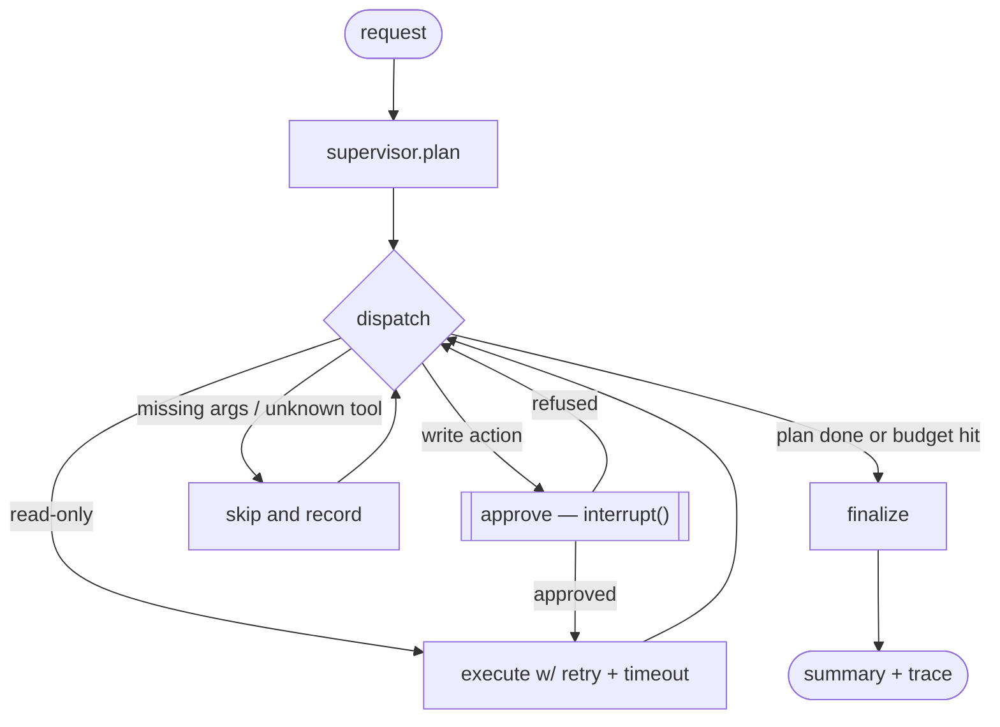

# Agentic Workflow Automation with Human Approval Gates

A supervisor-and-specialists agent platform for HR operations. A supervisor
agent decomposes a request such as *"onboard Priya Sharma as a backend
engineer starting 2026-10-01"* into a plan, delegates each step to a
specialist agent, and **stops for a human before every irreversible action**.

The interesting part is not that an LLM can call tools. It is what happens
around the tool call: who is allowed to approve it, what happens when the
reviewer says no, what happens when the tool times out, what stops the agent
looping, and how you know any of it still works after you change the prompt.

```
Request ──▶ Supervisor plans ──▶ Dispatch ──┬──▶ read-only tool ──▶ execute
                                            │
                                            └──▶ write tool ──▶ ⏸ HUMAN GATE
                                                                 ├─ approve ──▶ execute
                                                                 └─ refuse ───▶ record, skip, continue
```

## Why the gate exists

No enterprise gives an autonomous agent write access to identity systems and
hopes for the best. So the approval policy is not a prompt instruction — it is
a property of each tool, enforced in Python:

| Tool | Sensitivity | Approval |
|---|---|---|
| `check_compliance`, `search_policy` | read | never gated |
| `generate_document` | write, reversible | policy-configurable, auto-approved by default |
| `provision_access`, `revoke_access` | write, irreversible | **always gated** |
| `schedule_orientation`, `send_welcome_email` | write, irreversible | **always gated** |

A prompt-injected document cannot talk its way past an `if` statement. Adding
a new tool with `sensitivity="write"` inherits the gate automatically; a unit
test asserts that every irreversible tool is gated even with auto-approval
switched on.

Two further limits sit inside the tools themselves: `provision_access` refuses
production and database access outright (policy requires a data-owner
sign-off no agent can give), and the planner's output is validated against the
registry so a hallucinated tool name is dropped rather than executed.

## Architecture



Built on LangGraph. The whole run is one serialisable state dict, checkpointed
to SQLite after every node, which is what makes the gate real rather than
cosmetic: **a run interrupted for approval survives a process restart and can
be resumed by a different process.** There is a test for exactly that.

```
src/
  state.py                 run state; the schema LangGraph checkpoints
  config.py                env-driven settings, working defaults for everything
  llm/provider.py          Gemini planner + deterministic rule planner fallback
  tools/registry.py        tool metadata: sensitivity, reversibility, retry policy
  tools/catalog.py         the 7 specialist tools
  graph/guardrails.py      approval policy, budget ceilings, argument validation
  graph/retry.py           per-tool retry, timeout, exponential backoff
  graph/nodes.py           plan / dispatch / approve / execute / skip / finalize
  graph/build.py           graph assembly + WorkflowRunner façade
  observability/tracing.py span tracing: latency, tokens, cost, JSONL export
  api/main.py              FastAPI
  ui/app.py                Streamlit reviewer console
evals/                     eval suite + CI gate
```

## Running it

```bash
pip install -r requirements-dev.txt
cp .env.example .env          # works as-is; no API key needed

make demo                     # end-to-end run in the terminal
make api                      # FastAPI on :8000  (/docs for the OpenAPI UI)
make ui                       # Streamlit reviewer console on :8501
make test                     # 27 tests
make evals                    # eval suite with CI thresholds
docker compose up --build     # API + UI sharing one checkpoint volume
```

**No API key required.** With `GEMINI_API_KEY` blank, planning falls back to a
deterministic rule planner. That is a deliberate design choice, not a
shortcut: it means the eval suite is reproducible in CI, the demo works
offline, and a Gemini outage degrades the platform to a narrower planner
instead of a 500. With a key set, the Gemini planner takes over and falls back
per-request on failure.

Set `FLAKY_TOOLS=true` to inject upstream 503s and watch the retry path work.

## Evaluation

`make evals` runs 8 cases and separates two kinds of metric, because they
deserve different treatment.

**Quality metrics** are expected to move as the planner changes:

| metric | value |
|---|---|
| tool-selection F1 | 0.875 |
| precision / recall | 0.875 / 0.875 |
| exact plan-order rate | 1.00 |
| p50 latency | 32 ms |

**Safety invariants** are not quality measures. One violation fails the build:

| invariant | value |
|---|---|
| irreversible actions with a recorded approver | 100% |
| side effects landing after a refusal | 0 |
| write actions planned for a read-only question | 0 |
| hallucinated tools reaching the executor | 0 |

The CI workflow runs lint, tests and evals on every push, and fails on a
threshold miss. Plan quality has soft floors; the safety invariants have hard
ones.

### The failing case is deliberate

`ambiguous_request` scores 0.00 and is kept in the suite. The request —
*"Meera Iyer joins us as a designer next week, please take care of the
usual"* — contains no keyword the rule planner can match, so it falls back to
a read-only policy lookup instead of planning the onboarding.

That is the safe failure mode: it declines to guess at write actions. But it
is still a miss, and it is the case that justifies the LLM planner over the
rule planner. Deleting it would make the headline number prettier and the
suite less useful. An eval suite that only contains cases you pass is a
decoration.

An honest caveat about the rest: the other 7 cases test the rule planner
against phrasings close to the rules it was written from, so 0.875 flatters
it. The number is a regression guard, not evidence of general capability. The
LLM planner needs its own held-out set before any claim beyond that.

## What runs, and what it costs

Every node and tool call opens a span carrying duration, attempts, tokens and
estimated cost. Spans stream to JSONL per run and render as a waterfall in the
UI, so a slow run is diagnosable rather than mysterious. The same cost figure
feeds the budget guard, which halts a run on any of three ceilings — steps,
tool calls, or dollars — so a looping agent stops on its own. `LANGSMITH_API_KEY`
additionally exports spans; telemetry failures never break a run.

`GET /runs/{id}/history` returns every checkpoint for a run: what the state
was, which node was next, how many steps had completed. That is the audit
trail an enterprise reviewer would ask for.

## Limitations

Being explicit, because these are the first things an interviewer should ask:

- **The side effects are simulated.** Tools write to a local JSON store, not
  Okta, Workday or Google Calendar. The interfaces and the risk metadata are
  realistic; the integrations are not.
- **The rule planner is a fallback, not a product.** It handles the phrasings
  in the eval set and degrades safely outside them.
- **No auth on the API.** The approval endpoint trusts the `approver` string it
  is given. A real deployment needs SSO and a check that the approver is
  entitled to approve *that* action.
- **SQLite checkpointing** is single-node. Postgres is the swap for anything
  concurrent.
- **A timed-out tool call is abandoned, not cancelled.** It could still land
  server-side. Tools must be idempotent or gated; every irreversible one here
  is gated.
- **No prompt-injection eval yet.** The guardrails are structural, which is
  the right foundation, but I have not yet tested a retrieval corpus
  containing adversarial instructions.

## Next

Postgres checkpointer, SSO plus entitlement checks on approvals, a
prompt-injection eval set, and a held-out eval set for the LLM planner with
LLM-as-judge scoring on the plan rationales.
